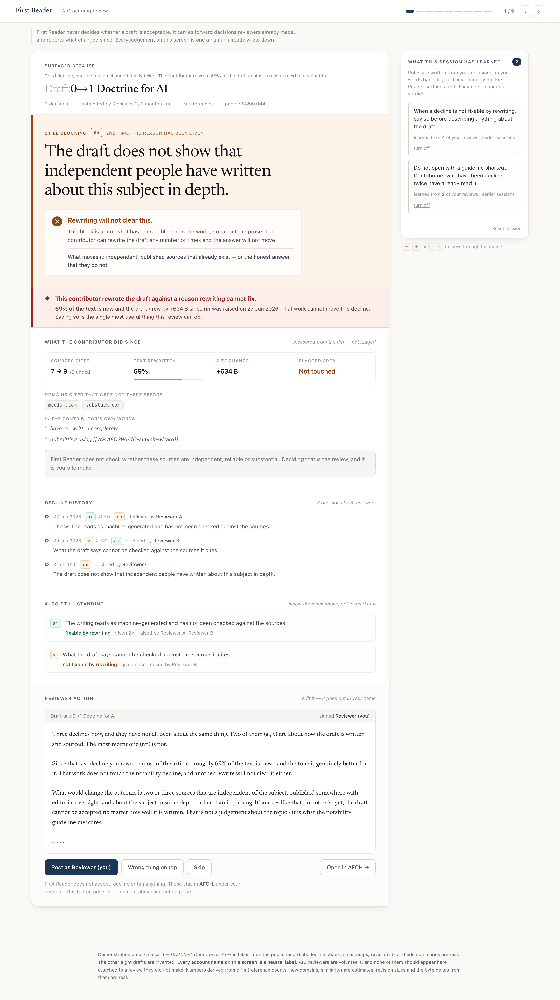

# First Reader

**It does not review drafts. It works out what is actually standing in the way, and whether rewriting can move it.**

An agent for the volunteers who review new Wikipedia articles, built with [Strands Agents](https://github.com/strands-agents/harness-sdk).

**[Open the reviewer screen →](https://minjikim89.github.io/first-reader/)** — the real UI, with real card data. Arrow keys move through the queue.



---

## The problem

A new Wikipedia article starts as a draft. Someone submits it, a volunteer reviews it, and if it is declined the reviewer attaches a code — `nn` for notability, `v` for sourcing, `ai` for machine-generated text. The contributor fixes it and submits again. This is Articles for Creation (AfC), and it is the front door to the encyclopedia.

Since August 2025 that door has been under load. `Category:AfC submissions declined as a large language model output` was created on **2025-08-04**. Thirteen months later it holds **5,948 declines** — the third most common reason to decline anything, six behind second place, and climbing.

But the load is not the interesting part. This is:

```
2026-06-27   declined  ai + nn     "the writing reads as machine-generated"
   ↓         contributor: "made changes re wrote organically"
2026-06-29   declined  v + ai      (nn is not mentioned)
   ↓         contributor: "have re- written completely"
2026-07-08   declined  nn          "does not show that independent people
                                    have written about this subject in depth"
```

Three reviewers, three different reasons, eleven days. The thing that was actually blocking it — notability — appeared as a footnote on day one, vanished on day two, and came back as the headline on day eleven.

**Notability is not something you can rewrite your way out of.** It depends on whether independent published sources about the subject exist in the world. This contributor rewrote 86% of the text, twice, against a wall that prose cannot move.

Across the 534 drafts in the shipped dataset, **67.8% are standing on a reason that rewriting cannot fix**, and 35.8% have been told that same reason twice or more.

## What it does

For each draft in the review queue, First Reader:

1. **Carries every prior decline forward.** Not just the most recent one. A reason that went quiet is not a reason that was resolved.
2. **Sorts them** so the thing actually standing in the way is on top.
3. **Says whether rewriting can clear it.** `v`, `nn`, `bio`, `corp` depend on sources existing. `ai`, `npov`, `adv` depend on the prose. The AfC template lists them at the same level, which is why contributors read "rewrite it" into all of them.
4. **Reports what the contributor changed** since the last decline — references added, how much text is new, whether they touched the part the reason pointed at. Measured from the diff, not judged.
5. **Flags the waste.** When someone has substantively rewritten against a reason rewriting cannot fix, that is the single most useful thing a reviewer can tell them.
6. **Prepares a comment** the reviewer may edit and post under their own account.

## What it does not do

- **It does not accept, decline, or reject anything.** Those stay in [AFCH](https://en.wikipedia.org/wiki/Wikipedia:WikiProject_Articles_for_creation/Helper_script), under the reviewer's account.
- **It does not write to Wikipedia.** Read-only. No bot approval (BRFA) is needed because nothing is posted by a bot — the reviewer posts, in their own name.
- **It does not judge whether a source is reliable, independent, or substantial.** Deciding that *is* the review. Doing it here would make this a second reviewer instead of a first reader.
- **It does not detect AI writing.** [`Wikipedia:Signs of AI writing`](https://en.wikipedia.org/wiki/Wikipedia:Signs_of_AI_writing) says detectors "should never be used as the sole evidence", and false positives fall hardest on contributors writing in a second language.

### It also does not add a review step

The obvious move is to put a bot in the review path. The evidence for that is weak. In an ICSE-SEIP 2025 industrial study ([arXiv:2412.18531](https://arxiv.org/abs/2412.18531), pp. 425-436), pull-request closing time after adopting automated review went from 5h52m to 8h20m across three projects — though one project went the other way (6h06m → 3h07m) and the authors treat it as an implementation and tuning problem rather than a property of review bots.

First Reader sidesteps the argument. It does not review, so it cannot add a review step.

## Architecture

See [`docs/architecture.md`](docs/architecture.md) for the full diagram and the reasoning behind each boundary.

```
                        trigger (queue poll / CLI)
                                  │
                                  ▼
   ┌──────────────────────── Strands Agent ────────────────────────┐
   │                                                               │
   │   tools ─────────────────────────────  reversibility grade    │
   │     get_draft_history                  reversible             │
   │     analyze_blockers                   reversible             │
   │     interpret_reasons                  reversible             │
   │     prepare_comment                    reversible             │
   │     judge_escalation                   reversible             │
   │     escalate_to_reviewer               partially reversible    │
   │     post_reviewer_decision             IRREVERSIBLE → denied   │
   │                                                               │
   │   interventions (gates, not prompt instructions)              │
   │     ReversibilityGate      denies anything irreversible,       │
   │                            and anything undeclared             │
   │     EscalationPolicyGate   denies an escalation the            │
   │                            deterministic judgment refused      │
   │     ReviewerCorrections    Transform: rewrites the next        │
   │                            call's arguments with a reviewer's  │
   │                            correction                          │
   │     AuditHandler           records every graded call           │
   └───────────────────────────────────────────────────────────────┘
                    │                             │
                    ▼                             ▼
        Wikipedia API (read-only)        reviewer queue (JSON cards)
        + local dataset cache                     │
                                                  ▼
                                        static reviewer UI (web/)
                                                  │
                                     reviewer edits and posts,
                                     in their own name, via AFCH
```

**What the model does, and what it is not allowed to do.** The model reads
prose and writes prose. It reads the 72 declines whose reason was typed as free
text instead of picked from a list, and it writes the note the reviewer posts.
It decides nothing: `family`, `fixable_by_rewrite`, attempt detection and the
escalation inequality are all deterministic, and a reading never overwrites one.
An unknown reason family stays unknown; the estimate sits beside it, labelled,
quoting the reviewer's own words, and a reviewer can correct it.

Numbers, codes and counts are handed to the writer already settled — counts as
words, so the model cannot render one wrong; the meaning of a decline code comes
from the AfC reason map rather than the model's guess. A note that asserts a
verdict on the draft, on a source, or on whether a reason was resolved is
rejected and the template writes it instead. Over the shipped dataset that
fired 13 times in 534 drafts — eight notes claiming a subject *is not notable*,
five claiming a reason *remains unaddressed* — and each one fell back rather
than going out. The gate is an output check, not a line in the prompt, so it
leaves a count behind. With no API key configured nothing
changes except the prose: the deterministic path runs and the templates write.

**The loop model and the reading model are chosen separately.** Walking a
five-step plan is deterministic work that the offline planner does for nothing.
Reading a reviewer's sentence is not. Pairing the two costs one call per draft,
plus one per free-text reason, instead of one per turn:

```python
run_review(title, interpreter=Interpreter(resolve_model("openrouter")))
```

With `FIRST_READER_MODEL=offline` that is one call to write the note plus one
per free-text reason, and a measured 1.9s per draft. Letting one model do both
adds a call per turn of the loop — seven turns on a typical draft — and takes
about 11s.

**The reviewer is upstream of the agent, not a gate after it.** When a reviewer
corrects a reading, the correction is not filed for someone to read later. On
the next run over that draft, a `Transform` intervention rewrites the arguments
of the interpretation call before it executes, so the tool uses the reviewer's
answer and the model is not asked again. `Deny` could only have thrown the call
away; `Confirm` could only have asked permission to make it.

**Where the decision is made.** Escalation is not a confidence threshold. It is:

```
escalate  iff  InterventionAdvantage × Cost × (1 − Recoverability)  >  InterruptionCost
```

`InterventionAdvantage` — how much a human looking at this would change the outcome — is not `P(error)`. A case the agent is likely to get wrong but a human would get equally wrong is not worth an interruption. This follows *Calibration Is Not Control* (2026-06); the two are different quantities and the second is the one that matters.

Every weight lives in one `Weights` dataclass, so a disputed escalation can be argued at the specific number rather than at the model's mood.

`InterruptionCost` is deliberately **not** scaled by queue depth. A backlog must not be able to silence the cases the backlog exists for.

**Cold start escalates everything.** Autonomy is earned from precedent, never assumed.

**Asymmetric learning.** Relaxing what the agent handles alone takes five agreements. Tightening takes one reversal, immediately. After a reversal, agreements keep accumulating but no relaxation is created while the tightening rule stands — getting autonomy back over something a human overruled takes a human. `wasted_rewrite` is structurally non-relaxable.

Rules are stored as sentences with their evidence, not as weights:

```
When an nn decline — a reason rewriting cannot fix — has been given twice and
no sources were added, carry it forward without asking.
  learned from 5 of your reviews · turn off · lock
```

## Numbers, and how to check them

Every figure here is recomputed from the shipped dataset by a script that prints the definition it used. Run them; do not take them on trust.

```bash
python scripts/metrics.py     # queue composition, family distribution, coverage
python scripts/backtest.py    # what carrying reasons forward actually catches
python scripts/compare_paths.py data/judgments.json data/judgments-llm.json
```

The third one is the safety claim, checkable. Both dumps ship, so it runs with
no API key and no spend: 534 drafts down the deterministic path and 534 down the
model path, diffed field by field. 1,032 prose fields differ, which is the
model's job. **Zero decision fields differ.** Regenerate either side with
`scripts/dump_judgments.py`.

| | |
|---|---|
| Drafts in the shipped dataset (all declined ≥2 times) | 534 |
| Declines parsed | 1,459 |
| Parse failure rate | **0.89%** at collection (20 of 2,250 screened drafts carried a template this parser would not guess at) |
| Declines that are source-existence problems | **61.1%** |
| Drafts whose top blocker cannot be fixed by rewriting | **67.8%** |
| …and were told that same reason twice or more | 35.8% |
| Card build failures | **0 / 534** |
| Reasons we declined to classify | 8 (0.5%) |

On a live-measured sample of 120 drafts, **18.3% are contributors rewriting against a reason rewriting cannot fix** — the case in the screenshot above, at scale.

### The backtest, including the number we threw away

The obvious measure is whether the top blocker predicts the next decline reason. It does, 36.2% of the time. **So does the trivial baseline of repeating the last reason — also 36.2%, and identically so by construction**, because sorting puts the most recent primary reason first. That number describes AfC, not this project, and `scripts/backtest.py` says so in its own output rather than letting it be quoted.

The measure that discriminates is whether the next reason was on the card at all:

| | |
|---|---|
| Carried-forward set contains the next primary reason | **58.7%** |
| The most recent decline alone contains it | 39.0% |
| **Gap — a reason went quiet and came back** | **19.7%** |

That 19.7% is the claim: one resubmission in five is blocked by something the last decline did not mention. All of it is overlap, not effect. Whether a reviewer would have decided differently given a different ordering is not observable in this data and is not claimed anywhere.

## Running it

```bash
git clone https://github.com/minjikim89/first-reader
cd first-reader
python -m venv .venv && source .venv/bin/activate
pip install -e ".[dev]"

# one draft, end to end
python -m first_reader.cli review "Draft:0→1 Doctrine for AI"

# the reviewer screen (no build step, no server)
open web/index.html
```

Tests:

```bash
pytest                  # 209 unit tests, no network, no inference
pytest -m integration   # 19 more, against the live Wikipedia API
```

The default model provider is not a provider. `OfflinePlannerModel` implements the Strands `Model` interface and drives the real event loop, the real tools and the real intervention layer deterministically, at zero cost. Set `FIRST_READER_MODEL` to use a real one.

## Data

Collected from the English Wikipedia API. No authentication, no scraping — `action=query` and `action=compare`, with `maxlag`, throttling and caching. Content is CC BY-SA 4.0, © its contributors.

`data/dataset.anonymized.jsonl` ships with the repo. Account names are replaced with stable labels (`Reviewer 041`, `Contributor 118`) — one label per person globally, so repeat-reviewer analysis survives. Every figure in this README is computed from this file, so what you run is what you read; the raw 540-draft file moves small counts by the six drafts dropped for naming an account in their title, and leaves the headline claims unchanged. Titles, page ids, revision ids and timestamps are preserved for reproducibility.

If you re-collect the raw file, it wins the search and real handles come back into the output — that is the point of having it. `FIRST_READER_DATASET=data/dataset.anonymized.jsonl` forces the de-identified copy, which is what anything shown to an audience should set.

**This is de-identification, not anonymity.** Revision ids are immutable, so anyone re-collecting from Wikipedia can rebuild the mapping. The goal is that the file we ship is not itself an index of who was declined for what. Re-collect the raw data yourself with `python -m first_reader.wiki.collect`.

See [`docs/data-provenance.md`](docs/data-provenance.md) for what is real, what is synthetic, and what is estimated in the demo fixtures.

## Known limitations

- **The reviewer screen's post button is inert.** It marks state and says so. Real posting needs OAuth and the action API; faking it in a demo would misrepresent what the tool does.
- **Free-text reason readings are estimates, and one in twenty is wrong.** 72 declines state the reason as prose rather than a code. The model produced a usable reading for 71 and named a family for 48; of a 20-case sample read by hand, 14 were clearly right, 5 were defensible or conservative, and 1 was wrong. Nothing is overwritten — the family stays `UNKNOWN` and the estimate sits beside it — but a reviewer who does not read the quote is trusting a machine that is wrong about one case in twenty.
- **Attempt signals are mechanical.** Reference counts, diff similarity, byte deltas. A reviewer writing *"the edit summary says it was rewritten from scratch, which is untrue"* is doing something this measurement cannot. Reading the summaries is [deferred](docs/next-steps.md).
- **A correction applies to one draft.** A reviewer correcting one reviewer's particular wording has not told us anything general about other wording, and the store does not pretend otherwise. Corrections are keyed by draft and code.
- **`similarity` and reference counts in the demo fixtures are estimates**, not measured values, and are labelled as such.
- **Learning is demonstrated, not proven.** Five agreements to relax means the effect needs sessions to accumulate. The demo shows the mechanism and a seeded history; it does not claim a measured improvement curve.
- **Known-answer probes are designed but not implemented.** Without them, a reviewer who approves everything out of fatigue would teach the system to relax. The asymmetric learning rule limits the damage; it does not detect the cause.

## Next

AfC comment parsing, edit-summary reading, LLM-authored rule sentences, and a
written escalation reason. Each is specified in
[`docs/next-steps.md`](docs/next-steps.md), along with the constraints every one
of them has to keep. Free-text reason interpretation and the written note are
done.

## License

MIT. See [LICENSE](LICENSE).

Built for the [Agents for Humans Hackathon](https://agentsforhumans.devpost.com/).
