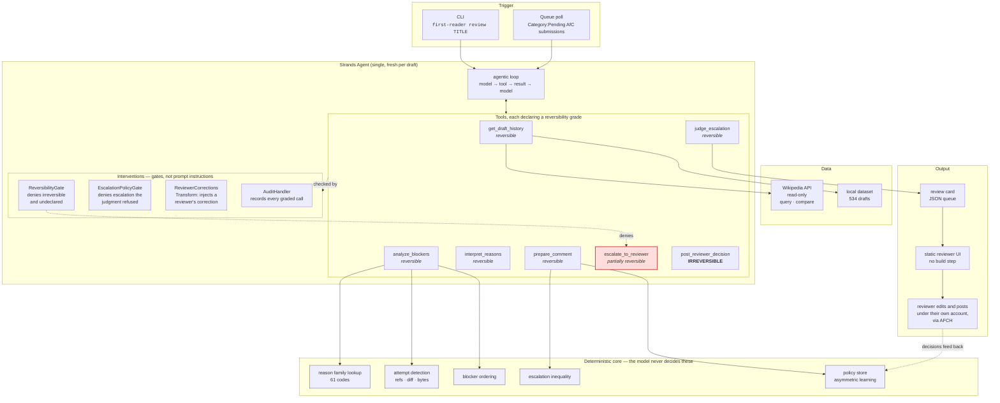

# Architecture

## The whole thing



## The five things the hackathon asks a diagram to show

| Required element | Here |
|---|---|
| **User input / interface** | CLI (`first-reader review "Draft:..."`), or a poll over the pending category. The reviewer's interface is a static HTML page in `web/` that opens with no server. |
| **Strands Agents** | One agent, rebuilt per draft. The model drives the loop and chooses tool order; the tools return structured results; the intervention layer gates every call before it runs. |
| **Tools & integrations** | Six tools (above). External integration is the English Wikipedia API, read-only: `action=query` for wikitext and revisions, `action=compare` for diffs. A local dataset serves the same shape offline. |
| **AWS services** | Amazon Bedrock as an optional model provider (`FIRST_READER_MODEL`). **Not required and not used by default** — see below. |
| **Output** | A review card as JSON in a queue directory, rendered by the static UI. The reviewer edits the prepared comment and posts it themselves through AFCH. Nothing is written to Wikipedia by this software. |

## Why the default model provider is not a provider

`OfflinePlannerModel` implements the Strands `Model` interface and emits a deterministic sequence of tool calls. It drives the real event loop, the real tools, and the real intervention layer — at zero cost, with no network, and reproducibly.

This is a deliberate choice, not a shortcut. Every judgment in this system is made by deterministic code that the model cannot reach: which family a reason belongs to, whether an attempt was made, what order blockers go in, whether to escalate. A language model that decided any of those would make this a second reviewer, and the entire safety argument of the project is that it is not one.

Set `FIRST_READER_MODEL` to run against Bedrock or another provider. The shape of a run is identical either way, which is the point.

## Where the model does belong

Reading what a regex cannot. 72 declines in the dataset use free text instead of a code — a reviewer writing *"the edit summary says it was rewritten from scratch, which is untrue; one section was added and the rest was not touched"* is carrying information no pattern match will recover.

The rule for that work: the model's output is an **estimate a reviewer corrects**, never a verdict. It is stored beside the deterministic classification, never on top of it, and it is labelled as an estimate everywhere it appears. A reviewer correcting an estimate is a `Transform` intervention — the correction rewrites the tool call's arguments and is recorded as the signal it is.

## Escalation

```
escalate  iff  InterventionAdvantage × Cost × (1 − Recoverability)  >  InterruptionCost
```

Not a confidence threshold, and deliberately not `P(error)`. A case the agent is likely to get wrong but a human would get equally wrong is not worth an interruption; what matters is how much a human looking at it changes the outcome. This follows *Calibration Is Not Control* (2026-06).

`InterventionAdvantage` is estimated from **evidence state**, never from a number the model supplies:

| State | Advantage | Why |
|---|---|---|
| `wasted_rewrite` | highest | The contributor is burning time right now. Nothing else this system can say is worth more. |
| `inconsistent_reviewers` | high | Reviewers gave different reasons; a human resolves that, code cannot. |
| `attempt_not_measured` | high | We did not look. Not looking is not the same as nothing happening. |
| `unknown_family` | high | We do not know whether rewriting can fix this. |
| `no_precedent` | high | Cold start. Autonomy is earned. |
| `repeated_reason_no_attempt` | low | Same reason, nothing added, and we checked. |
| `routine` | low | Precedent exists and agrees. |

`InterruptionCost` is **not** scaled by queue depth. A backlog must not be able to silence the cases the backlog exists for.

Every weight lives in one `Weights` dataclass. A disputed escalation can be argued at the specific number.

## Reversibility

Each tool declares a grade in `ToolSpec["annotations"]`. This field is not forwarded to provider APIs, so the grading costs zero tokens.

| Grade | Handling | Examples |
|---|---|---|
| Reversible | Runs, then reports | Carrying reasons forward, ordering, preparing text |
| Partially reversible | Runs, cancellable | Filing a card to the queue |
| **Irreversible** | **Denied. Always.** | Posting, accepting, declining |

`ReversibilityGate` denies anything graded irreversible **and anything undeclared**. A tool added later without a grade is refused rather than assumed safe.

## Where the model is used, and where it is not

Two jobs, both interpretation, neither a decision.

`interpret_reasons` reads the 72 declines whose reason was typed as free text rather than picked from a list. It places the prose in one of three existing families, or answers "cannot tell". It cannot invent a decline code, it never writes to `Blocker.family`, and a reading whose quoted evidence does not appear in the reviewer's text is dropped before anyone sees it. The estimate travels beside the fact, under a separate `interpretation` key on the queued card.

`prepare_comment` writes the note. Every code, count, family and percentage is handed over already decided — counts as words, so the model cannot render one wrong; code meanings from the AfC reason map, so it cannot invent one. A note that asserts a verdict on the draft, on a source, or on whether a reason was resolved is rejected and the template writes it instead.

Everything else — family lookup, `fixable_by_rewrite`, attempt detection, blocker ordering, the escalation inequality, the policy — is deterministic. With no model configured, all of it still runs and the templates write the prose.

## The reviewer as co-author

`ReviewerCorrections` is a `Transform` intervention, and it is the only place a person changes what the agent *does* rather than approving what it already did.

```
reviewer corrects a reading
        │
        ▼
policy store records  was → now
        │
        ▼
next run: before_tool_call on interpret_reasons
        │
        ▼
Transform rewrites tool_use["input"]["known_readings"]
        │
        ▼
the tool uses the reviewer's answer; the model is not asked again
```

`Deny` could only have thrown the call away. `Confirm` could only have asked permission to make it. `Transform` is what lets a correction become an argument.

A correction is keyed by draft and code. A reviewer correcting one reviewer's particular wording has told us nothing general about other wording, and the store does not pretend otherwise.

## Learning

Asymmetric, because the costs are asymmetric.

```
relax   (handle alone)     5 agreements
tighten (return to human)  1 reversal, immediately
```

After a reversal, agreements keep accumulating but no relaxation is created while the tightening rule stands. Getting autonomy back over something a human overruled takes a human. `wasted_rewrite` is structurally non-relaxable.

Rules are stored as sentences with their evidence and three switches (active / off / locked), not as weights. A weight cannot be read, argued with, or turned off by the person it is learned from.

## Session shape

The agent is built fresh per draft. When it escalates, it writes a card to the queue directory and the run **ends** — nothing is held open across human latency.

This avoids [harness-sdk#3651](https://github.com/strands-agents/harness-sdk/issues/3651), where a turn interrupted during tool execution leaves `toolUse`/`toolResult` unpaired and corrupts the session permanently. It also avoids [#3076](https://github.com/strands-agents/harness-sdk/issues/3076) (P1, bug-validated), where nested agent-as-tool interrupts fail to survive a restart — which is why this is a single agent and not a multi-agent graph.

See [`strands-api-notes.md`](strands-api-notes.md) for the API surface as verified against `strands-agents 1.54.0`, including two places the documentation and our initial assumptions were wrong.
